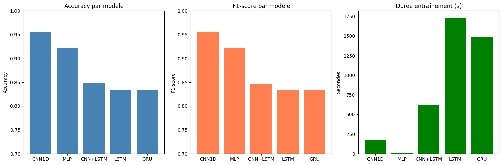

# 🏃 Human Activity Recognition — Deep Learning Comparison


> Comparaison complète de 5 architectures Deep Learning (MLP, CNN 1D, LSTM, GRU, CNN+LSTM) pour la reconnaissance automatique d'activités humaines à partir de capteurs smartphone. Tous les runs sont trackés avec MLflow.

---

## 📊 Résultats

| Modèle | Accuracy | F1-score | Durée (s) |
|--------|----------|----------|-----------|
| 🥇 **CNN 1D** | **0.9555** | **0.9554** | 174.35 |
| 🥈 **MLP** | **0.9213** | **0.9210** | **15.72** |
| 🥉 CNN+LSTM | 0.8480 | 0.8463 | 615.79 |
| LSTM | 0.8331 | 0.8332 | 1733.58 |
| GRU | 0.8331 | 0.8332 | 1485.88 |



---

## 🎯 Contexte

Identifier automatiquement une activité humaine à partir des capteurs d'un smartphone (accéléromètre + gyroscope). Ce type de système est utilisé dans :
- Les applications de santé et fitness
- Les systèmes de surveillance médicale
- Les interfaces homme-machine intelligentes
- L'IoT et les objets connectés

---

## 📁 Structure du projet

```
projet-dl-har/
├── notebooks/
│   └── projet1_har.ipynb      ← Notebook complet
├── results/
│   └── comparaison_modeles.png ← Graphique comparatif
├── models/                     ← Modèles sauvegardés (MLflow)
├── data/
│   └── .gitkeep               ← Dataset à télécharger séparément
├── requirements.txt
└── README.md
```

---

## 📦 Dataset

**UCI HAR Dataset** — University of California, Irvine

| Paramètre | Valeur |
|-----------|--------|
| Échantillons train | 7 352 |
| Échantillons test | 2 947 |
| Features | 561 |
| Classes | 6 |

**6 activités :**
```
1 → WALKING
2 → WALKING_UPSTAIRS
3 → WALKING_DOWNSTAIRS
4 → SITTING
5 → STANDING
6 → LAYING
```

**Téléchargement :**
```bash
cd data
curl -O "https://archive.ics.uci.edu/ml/machine-learning-databases/00240/UCI%20HAR%20Dataset.zip"
unzip "UCI HAR Dataset.zip"
```

---

## 🏗️ Architectures

### MLP
```
Input(561) → Dense(256, ReLU) → Dropout(0.3)
           → Dense(128, ReLU) → Dropout(0.3)
           → Dense(64, ReLU)
           → Dense(6, Softmax)
```

### CNN 1D
```
Input(561,1) → Conv1D(64, k=3, ReLU) → MaxPooling1D(2)
             → Conv1D(128, k=3, ReLU) → MaxPooling1D(2)
             → Flatten → Dense(128, ReLU) → Dropout(0.3)
             → Dense(6, Softmax)
```

### LSTM
```
Input(561,1) → LSTM(128, return_seq=True)
             → LSTM(64)
             → Dense(64, ReLU) → Dropout(0.3)
             → Dense(6, Softmax)
```

### GRU
```
Input(561,1) → GRU(128, return_seq=True)
             → GRU(64)
             → Dense(64, ReLU) → Dropout(0.3)
             → Dense(6, Softmax)
```

### CNN + LSTM
```
Input(561,1) → Conv1D(64, k=3, ReLU) → MaxPooling1D(2)
             → LSTM(128)
             → Dense(64, ReLU) → Dropout(0.3)
             → Dense(6, Softmax)
```

---

## 🔍 Conclusions scientifiques

**1. CNN 1D — Meilleure accuracy (95.55%)**
CNN 1D détecte efficacement les patterns locaux dans les 561 features pré-calculées. Les filtres convolutifs capturent des corrélations locales entre features adjacentes, ce qui explique sa supériorité.

**2. MLP — Meilleur rapport accuracy/vitesse**
Avec 92.13% d'accuracy en seulement 15 secondes, MLP est le choix optimal quand la vitesse d'entraînement est prioritaire. Sa simplicité est un avantage sur des features déjà extraites.

**3. LSTM et GRU — Sous-performances sur features pré-calculées**
LSTM et GRU sont conçus pour les séquences temporelles brutes. Sur des features statistiques déjà calculées, ils n'apportent pas de valeur ajoutée et sont beaucoup plus lents. Ils seraient plus performants sur les signaux bruts des capteurs.

**4. CNN+LSTM — Compromis intéressant**
La combinaison CNN+LSTM (84.80%) bénéficie de l'extraction de features par CNN avant l'apprentissage séquentiel LSTM, ce qui explique sa supériorité sur LSTM seul.

---

## 🛠️ Installation

```bash
# Cloner le repo
git clone https://github.com/bipanda93/projet-dl-har.git
cd projet-dl-har

# Créer l'environnement
conda create -n dl_env python=3.10 -y
conda activate dl_env

# Installer les dépendances
pip install -r requirements.txt

# Télécharger le dataset
cd data
curl -O "https://archive.ics.uci.edu/ml/machine-learning-databases/00240/UCI%20HAR%20Dataset.zip"
unzip "UCI HAR Dataset.zip"
cd ..

# Lancer MLflow UI
mlflow ui --backend-store-uri file:///path/to/mlruns --port 5001

# Ouvrir le notebook
jupyter notebook notebooks/projet1_har.ipynb
```

---

## 📈 MLflow Tracking

Tous les runs sont trackés avec MLflow :

```python
mlflow.set_experiment("projet1_har")

with mlflow.start_run(run_name="CNN1D"):
    mlflow.log_param("model", "CNN1D")
    mlflow.log_metric("accuracy", acc)
    mlflow.log_metric("f1_score", f1)
    mlflow.log_metric("duree_sec", duree)
```

**Lancer l'interface MLflow :**
```bash
mlflow ui --backend-store-uri file:///Users/macbook/Desktop/mlruns --port 5001
```
Puis ouvrir : `http://127.0.0.1:5001`

---

## 👤 Auteur

**Bipanda Franck Ulrich**
Mastère Data Engineering — Digital School de Paris — Promotion 2026

[](https://linkedin.com/in/franck-bipanda-13392372)
[](https://datascienceportfol.io/bipandaf)
[](https://github.com/bipanda93)

---

## 📚 Références

- [UCI HAR Dataset](https://archive.ics.uci.edu/ml/datasets/human+activity+recognition+using+smartphones)
- Davide Anguita et al. — *A Public Domain Dataset for Human Activity Recognition Using Smartphones* (2013)
- [TensorFlow Documentation](https://www.tensorflow.org)
- [MLflow Documentation](https://mlflow.org)
